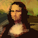

# 🎨 Genetic Painter

> **An Evolutionary Algorithm that learns to paint like a human, stroke by stroke.**


## 📖 Overview

**Genetic Painter** is a Python-based Evolutionary Algorithm (EA) that recreates images using vector strokes rather than pixels.

Unlike traditional image evolution that starts with random noise, **Genetic Painter mimics a human artist's workflow**. The population begins with largely **empty canvases**. The AI learns to apply broad, low-opacity strokes first to establish the composition (blocking), and then evolves to add smaller, high-opacity strokes to refine details and sharpen edges.

This project emphasizes **structural integrity** and **natural layering** by utilizing a custom hybrid fitness function and advanced mutation strategies.

## 📸 Gallery: The Digital Painter in Action

Here are the results of the algorithm starting from an empty canvas. Notice how it captures the general structure first and then layers details.

| Experiment | Target Image | Generated Art |
| :---: | :---: | :---: |
| **1. Mona Lisa** |  |  |
| **2. Roco** |  |  |

*(Note: Images are 64x64 resolution, upscaled for visibility)*

## ✨ Key Features

### 🧬 Genetic Algorithm Architecture
* **Vector Genome:** Evolves a dynamic list of strokes (coordinates, color, thickness, alpha) instead of a fixed grid of pixels.
* **The "Painter's" Approach:** Starts with minimal strokes. The algorithm uses the **Painter's Algorithm** (rendering back-to-front) to fix mistakes by painting over them.
* **Hybrid Vision:** Uses a weighted combination of **CIELAB Delta-E** (Color Accuracy) and **SSIM** (Structural Similarity) to balance color correctness with sharp edge alignment.

### 🧠 Advanced Mutation & Crossover
* **One-Action Mutation:** Each generation, an individual performs exactly one action (Add, Delete, Modify, or Split) to isolate fitness improvements.
* **Ghost Strokes:** New strokes are often initialized with very low opacity ("Ghost Mode"). This allows them to enter the genome without "shocking" the fitness function, gradually becoming visible over generations.
* **Stroke Splitting (Mitosis):** A long stroke can split into two connected segments, allowing the AI to refine local details (like an elbow or corner) without destroying the overall shape.
* **Hybrid Crossover:** Randomly chooses between **Spatial Crossover** (stitching left/right halves of parents) and **Blending Crossover** (mixing stroke layers).


## 🛠️ Installation

1.  **Clone the repository**
    ```bash
    git clone https://github.com/hchadha28/Genetic-Painter.git
    cd genetic-painter
    ```

2.  **Install dependencies**
    ```bash
    pip install requirements.txt
    ```

3.  **Add a Target Image**
    * Place your desired 64x64 target image in the root folder and name it `target.png`.

## 🚀 Usage

Run the main evolution script:

```bash
python -m src.main
```


